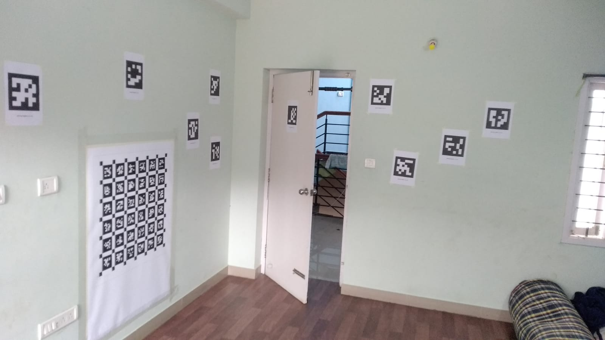
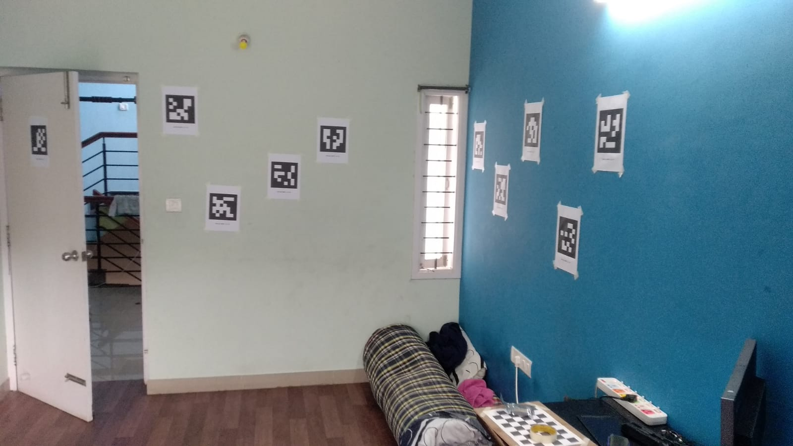

# Camera calibration challenge
From the given dataset obtain the camera intrinsics (i.e. Calibration matrix, distortion parameters) and extrinsics (Relative pose of arducam1 wrt arducam0)

## Scene description
* Apriltag 45 to 59 is present of size 0.173m
* Tags are printed from [this](./tag36h11.pdf) pdf.

## Bags
1. `data0.bag`: compressed image stream of arducam0 looking at [A4_chessboard](./A4_chessboard.pdf).
2. `data1.bag`: compressed image stream of arducam1 looking at [A4_chessboard](./A4_chessboard.pdf).
3. `data2.bag`: compressed image stream of arducam0 looking at [april_6x6_80x80cm_A0](./april_6x6_80x80cm_A0.pdf).
4. `data3.bag`: compressed image stream of arducam1 looking at [april_6x6_80x80cm_A0](./april_6x6_80x80cm_A0.pdf).
4. `data4.bag`: sequence 1 of recording of unsynchronized compressed image from arducam0 and arducam1.
5. `data5.bag`: sequence 2 of recording of unsynchronized compressed image from arducam0 and arducam1.
